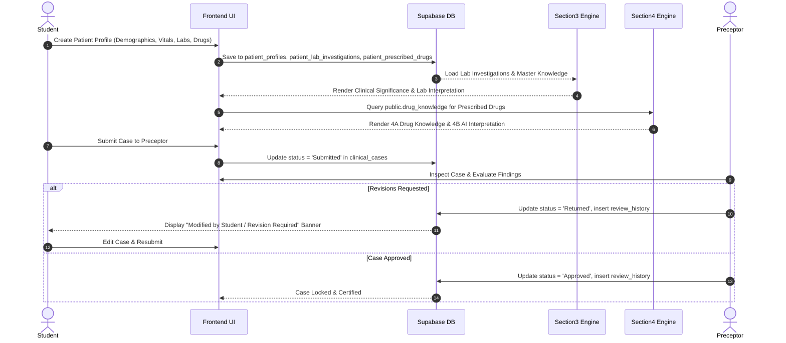

# PHARMDVERSE ERP — MASTER SYSTEM WORKFLOW & ARCHITECTURE DOCUMENT

> **CONFIDENTIAL & AUTHORITATIVE SYSTEM REFERENCE**
> **Platform**: PharmDVerse Clinical Pharmacy ERP Platform
> **Architecture Version**: 2.0 (Supabase PostgreSQL + Vite React ESM)
> **Author**: Antigravity AI Engineering Team

---

## 1. SYSTEM OVERVIEW

PharmDVerse is a multi-tenant, multi-role Clinical Pharmacy ERP Platform designed for Pharm.D (Doctor of Pharmacy) academic institutions, hospital clinical postings, preceptor evaluations, and AI-assisted clinical medication interpretation.

The system is governed by a **4-Tier Role Hierarchy**:
1. **Super Admin (Global Governance)**: System-wide administration, college onboarding, subscription management, and central Drug Knowledge / Lab Parameter Knowledge master management.
2. **College Admin (Institutional Governance)**: College-specific configuration, faculty/preceptor onboarding, student enrollment, academic batch management, preceptor-student assignments, document branding, and case audit.
3. **Preceptor (Clinical Faculty & Reviewer)**: Clinical case evaluation queue, structured 4-step review (Annotation, Change Requests, Approval), feedback generation, intervention evaluation, and student clinical progress tracking.
4. **Student (Clinical Case Author & Trainee)**: Patient profile entry, 6-step clinical case workflow, Section 3 laboratory evaluation, Section 4A drug knowledge retrieval, Section 4B AI clinical medication interpretation, Adverse Drug Reaction (ADR) reporting, Patient Counselling, and Pharmacist Interventions.

---

## 2. PUBLIC LANDING PAGE WORKFLOW

```text
                                VISITOR
                                   ↓
                         MAIN LANDING PAGE (App.jsx: viewMode === 'landing')
                                   │
       ┌───────────────────────────┼───────────────────────────┐
       ↓                           ↓                           ↓
VIEW PUBLIC INFO          EXPLORE ACTIVE COLLEGES        REGISTER YOUR COLLEGE
- Hero Banner             - Searchable College Cards     - Request Onboarding Form
- Platform Features       - "Open Portal" Action         - Saves to public.registration_requests
- Pricing Modal           - Filter by City/State         - Pending Super Admin Review
- Contact Modal           - Direct Portal Navigation
```

### Public Functionality Audit:
- **Landing Page Header**: Platform branding, Dark Mode toggle, Navigation links (*Pricing*, *Contact*, *Register College*, *Sign In*).
- **Hero & Active Colleges**: Displays live onboarded colleges from `public.colleges`. Clicking **"Open Portal"** sets `viewMode = 'college_portal'` with the selected college context saved in session storage.
- **Register Your College**: Form modal allowing pharmacy colleges to submit registration applications. Inserts clean records into `public.registration_requests`.

---

## 3. SUPER ADMIN WORKFLOW

- **Entry Point**: Keyboard shortcut (`Ctrl + Alt + D`) or Super Admin Modal $\rightarrow$ Authenticates against `public.super_admin` or environment credentials.
- **Dashboard View**: [`SuperAdminDashboard.jsx`](file:///c:/Users/tsrir/OneDrive/Desktop/newx/src/components/admin/SuperAdminDashboard.jsx).

```text
                          SUPER ADMIN WORKFLOW
                                   ↓
┌─────────────────┬──────────────────┬───────────────────┬────────────────────┐
↓                 ↓                  ↓                   ↓                    ↓
REGISTRATION      ACTIVE COLLEGES    EXPIRED SUBSCRIP.   DRUG KNOWLEDGE       SYSTEM AUDIT
REQUESTS          MANAGEMENT         MONITORING          MASTER               & GOVERNANCE
- Approve/Reject  - View Details     - Renewal alerts    - Manage 683+ generic- Global stats
- Remarks         - Deactivate       - Max student limit   drugs in Supabase   - RLS policies
- Onboarding      - Edit Profile     - Expiry dates      - 10 Schema Fields   - Session checks
```

### Key Super Admin Modules:
1. **Registration Applications**: Inspects `public.registration_requests`. Approving automatically creates a college record in `public.colleges`, generates a default `public.college_admins` account, and initializes a `public.subscriptions` record.
2. **Active Colleges Governance**: Manages subscription quotas, maximum student limits, active/inactive statuses, and PCI approval records.
3. **Drug Knowledge Master Management** ([`DrugKnowledgeManagementView.jsx`](file:///c:/Users/tsrir/OneDrive/Desktop/newx/src/components/admin/DrugKnowledgeManagementView.jsx)): Centralized interface serving as the **Single Source of Truth** (`public.drug_knowledge`). Allows real-time search, adding generic drugs with duplicate prevention, editing 10 database schema fields, and immediate live reflection across Section 4A & 4B.

---

## 4. COLLEGE ADMIN WORKFLOW

- **Entry Point**: College Portal $\rightarrow$ College Admin Login Modal $\rightarrow$ Authenticates against `public.college_admins`.
- **Dashboard Layout**: [`CollegeAdminLayout.jsx`](file:///c:/Users/tsrir/OneDrive/Desktop/newx/src/components/collegeAdmin/CollegeAdminLayout.jsx).

```text
                         COLLEGE ADMIN WORKFLOW
                                   ↓
┌───────────────┬────────────────┬─────────────────┬──────────────────┬──────────────┐
↓               ↓                ↓                 ↓                  ↓              ↓
FACULTY/        STUDENT          PRECEPTOR-STUDENT CLINICAL CASE      DOCUMENT       SECURITY &
PRECEPTORS      MANAGEMENT       ASSIGNMENTS       OVERVIEW           BRANDING       ACCOUNT
- Add Faculty   - Add Student    - Bulk Assign     - Track Statuses   - Letterhead   - Password
- Edit Details  - Promote Year   - Reassign        - Review History   - Watermark    - Login Audit
- Reset Pass    - Import List    - Workload View   - Export PDFs      - PCI Header   - Active Token
```

### Key College Admin Modules:
1. **Preceptor Management**: Add/Edit clinical faculty, assign departments (`Pharmacy Practice`, `Clinical Pharmacy`, `Internal Medicine`), manage credentials.
2. **Student Management**: Enroll Pharm.D students (Years 1–6 / Internship), manage academic year promotions, assign roll numbers and batches.
3. **Student-Preceptor Assignments**: Create & update links in `public.student_preceptor_assignments` connecting students to their assigned preceptor.
4. **Document Branding**: Customize institutional letterhead headers, logos, PCI approval numbers, and watermark configurations stored in `public.college_branding`.

---

## 5. PRECEPTOR WORKFLOW

- **Entry Point**: College Portal $\rightarrow$ Preceptor Login Modal $\rightarrow$ Authenticates against `public.preceptors`.
- **Dashboard Layout**: [`PreceptorLayout.jsx`](file:///c:/Users/tsrir/OneDrive/Desktop/newx/src/components/preceptor/PreceptorLayout.jsx).

```text
                           PRECEPTOR WORKFLOW
                                   ↓
┌─────────────────┬──────────────────┬───────────────────┬────────────────────┐
↓                 ↓                  ↓                   ↓                    ↓
MY ASSIGNED       CLINICAL CASE      CASE REVIEW &       PHARMACOVIGILANCE    STUDENT PROGRESS
STUDENTS          REVIEW QUEUE       EVALUATION ENGINE   & COUNSELLING REVIEW & ANALYTICS
- List Trainees   - Pending Cases    - 4-Step Review     - ADR Reports Review - Evaluation Logs
- View Details    - Returned Cases   - Line Annotations  - Intervention Approval- PDF Exports
- Assignments     - Approved Cases   - Change Requests   - Patient Advice Review- Case Statistics
```

### Key Preceptor Review Engine:
- **Review Queue**: Filter cases assigned to preceptor via `public.student_preceptor_assignments`.
- **4-Step Case Evaluation**:
  1. **Step 1 — Comprehensive Inspection**: View full Student Patient Profile, Vitals, Labs, Section 3 Interpretation, Section 4A Drug Knowledge, Section 4B AI Interpretation.
  2. **Step 2 — Line-by-Line Annotation**: Highlight specific student fields and attach correction notes.
  3. **Step 3 — Action Decision**: Select **Approve** (locks case as Approved) or **Request Revisions** (returns case to student with feedback notes).
  4. **Step 4 — Audit History Log**: Appends immutable log entry to `public.clinical_case_review_history`.

---

## 6. STUDENT WORKFLOW

- **Entry Point**: College Portal $\rightarrow$ Student Login Modal $\rightarrow$ Authenticates against `public.students`.
- **Dashboard Layout**: [`StudentLayout.jsx`](file:///c:/Users/tsrir/OneDrive/Desktop/newx/src/components/student/StudentLayout.jsx).

```text
                            STUDENT WORKFLOW
                                   ↓
┌─────────────────┬──────────────────┬───────────────────┬────────────────────┐
↓                 ↓                  ↓                   ↓                    ↓
STUDENT           PATIENT PROFILE    SECTION 3: LABS     SECTION 4A/4B:       SPECIALIZED
DASHBOARD         ENTRY (1-6 STEPS)  INTERPRETATION      DRUG KNOWLEDGE & AI  CLINICAL MODULES
- Case Statistics - Demographics     - 5-Tier Lookup     - Supabase DB Fetch  - ADR Reporting
- Status Track    - Histories        - Numeric Eval      - Trade Resolution   - Patient Counselling
- Return Alerts   - Vitals & Labs    - Qualitative Eval  - AI Synthesis       - Interventions
- Action Items    - Prescriptions    - Significance      - Monitoring Notes   - PDF Document Export
```

---

## 7. CLINICAL CASE LIFECYCLE



---

## 8. LABORATORY WORKFLOW

```text
PATIENT DOCUMENTATION FORM (62 Official Parameters across 10 Categories)
                         ↓
STUDENT CASE ENTRY UI (PatientProfileFormView.jsx)
                         ↓
AUTOMATED 5-TIER RETRIEVAL ENGINE (lookupSingleIngredientInSupabase)
Tier 1: Controlled Alias Check (e.g. S.Cr → Serum Creatinine, Na → Sodium)
Tier 2: Exact Case-Insensitive ILIKE Match
Tier 3: Substring ILIKE Match
Tier 4: Automated Fuzzy Prefix Pattern Match (e.g. Hydrochlorthiazide → Hydrochlorothiazide)
Tier 5: Brand Names ILIKE Search (e.g. Aquazide → Hydrochlorothiazide)
                         ↓
patient_lab_investigations (Stores Numeric & Qualitative Values in varchar test_value)
                         ↓
SECTION 3 LAB EVALUATION ENGINE (StudentAiAnalysisView.jsx)
Evaluates Result Status: Increased, Decreased, Within Range, Positive, Negative, Present, Absent, Qualitative
                         ↓
SECTION 4B AI MONITORING PRIORITIZATION (aiAnalysisService.js)
Triggers Renal/Hepatic/Electrolyte Dose Warnings (e.g. Elevated Serum Creatinine → Amikacin Warning)
```

---

## 9. DRUG KNOWLEDGE WORKFLOW

- **Single Source of Truth**: `public.drug_knowledge` in Supabase (683 verified generic drug records). Zero duplicate drug tables.
- **Resolution Strategy**:
  1. Student enters prescribed trade name (e.g. `Tab. Augmentin 625`, `Tab. Tripride`, `Inj. Amikacin`).
  2. `resolveTradeNameToGeneric()` parses dosage form, trade name, strength, and active ingredients (supporting 1, 2, 3, 4+ drug FDCs).
  3. `fetchMultipleDrugKnowledgeFromSupabase()` queries `public.drug_knowledge` for each ingredient.
  4. Displays complete 10 schema fields in Section 4A.
  5. Passes structured drug knowledge context into Section 4B AI Clinical Medication Interpretation Engine.

---

## 10. SECTION 4A / 4B RELATIONSHIP

- **Section 4A — Drug Knowledge Retrieval & Display**: Database-driven display of verified pharmacological data retrieved directly from Supabase (`public.drug_knowledge`).
- **Section 4B — AI Clinical Medication Interpretation**: Algorithmic clinical synthesis engine ([`aiAnalysisService.js`](file:///c:/Users/tsrir/OneDrive/Desktop/newx/src/services/aiAnalysisService.js)) combining Section 3 lab findings, patient demographics, organ function risks, and Section 4A drug knowledge to generate actionable clinical recommendations.

---

## 11. ADR REPORTING WORKFLOW

- **Module Component**: [`ADRDocumentationFormView.jsx`](file:///c:/Users/tsrir/OneDrive/Desktop/newx/src/components/adrDocumentation/ADRDocumentationFormView.jsx).
- **Database Table**: `public.adr_reports`.
- **Causality Assessment Scales**:
  - **Naranjo Causality Algorithm**: 10 objective questions calculating score (-4 to +13) $\rightarrow$ *Definite* (≥9), *Probable* (5-8), *Possible* (1-4), *Doubtful* (≤0).
  - **WHO-UMC Causality Scale**: *Certain*, *Probable/Likely*, *Possible*, *Unlikely*, *Conditional/Unclassified*, *Unassessable/Unclassifiable*.
- **Severity & Outcome**: Categorizes severity (*Mild*, *Moderate*, *Severe*) and outcome (*Recovered*, *Recovering*, *Not Recovered*, *Fatal*).

---

## 12. PATIENT COUNSELLING WORKFLOW

- **Module Component**: [`PatientCounsellingFormView.jsx`](file:///c:/Users/tsrir/OneDrive/Desktop/newx/src/components/patientCounselling/PatientCounsellingFormView.jsx).
- **Database Table**: `public.patient_counselling`.
- **Core Evaluation Areas**: Medication administration instructions, storage conditions, dietary/lifestyle modifications, side effect awareness, adherence barriers, and follow-up plan.

---

## 13. REPORTS & PDF GENERATION WORKFLOW

- **Document Engine**: [`ClinicalCaseDocumentRenderer.jsx`](file:///c:/Users/tsrir/OneDrive/Desktop/newx/src/components/branding/ClinicalCaseDocumentRenderer.jsx).
- **Branding Container**: [`PharmDVerseBrandedDocumentContainer.jsx`](file:///c:/Users/tsrir/OneDrive/Desktop/newx/src/components/branding/PharmDVerseBrandedDocumentContainer.jsx).
- **PDF Export**: Uses `html2canvas` and `jsPDF` to generate official, printable clinical case reports featuring institutional letterhead, college logo, PCI approval details, student details, preceptor signature block, and document watermark.

---

## 14. NOTIFICATIONS ARCHITECTURE

- **UI Component**: [`InlineActionNotification.jsx`](file:///c:/Users/tsrir/OneDrive/Desktop/newx/src/components/common/InlineActionNotification.jsx).
- **Notification Database Table**: `public.notifications`.
- **Session Conflict Banner**: Real-time modal ([`SessionConflictModal.jsx`](file:///c:/Users/tsrir/OneDrive/Desktop/newx/src/components/modals/SessionConflictModal.jsx)) triggered when a user attempts a second simultaneous login.

---

## 15. AUTHENTICATION ARCHITECTURE

- **Authentication Service**: [`src/services/authService.js`](file:///c:/Users/tsrir/OneDrive/Desktop/newx/src/services/authService.js).
- **Security**: SHA-256 password hashing via Web Crypto API (`SubtleCrypto`).
- **Role Tables**:
  - `public.students` (username/email + `password_hash` + `college_id`)
  - `public.preceptors` (username/email + `password_hash` + `college_id`)
  - `public.college_admins` (email + `password_hash` + `college_id`)
  - `public.super_admin` (email + `password_hash`)
- **Custom HTTP Headers for RLS Isolation**:
  - `x-student-id`: Identifies active student session.
  - `x-preceptor-id`: Identifies active preceptor session.
  - `x-college-id`: Enforces tenant college isolation.

---

## 16. SESSION MANAGEMENT ARCHITECTURE

- **Database Table**: `public.active_sessions`.
- **Single Active Session Rule**: Enforced per `user_role + user_id` via PostgreSQL partial unique index:
  ```sql
  CREATE UNIQUE INDEX idx_single_active_session ON public.active_sessions (user_role, user_id) WHERE (is_active = true);
  ```
- **Periodic Heartbeat**: `App.jsx` executes a 10-second periodic verification (`verifyActiveSessionTokenInSupabase`). If invalidated by a 2nd device, the 1st device automatically logs out and displays a session ended banner.

---

## 17. SUPABASE DATABASE ARCHITECTURE (22 Public Tables)

| Table Name | Primary Key | Key Foreign Keys | Purpose | Access Roles |
| :--- | :--- | :--- | :--- | :--- |
| **`active_sessions`** | `id` (uuid) | None | Single active session tracking per user | All Users |
| **`adr_reports`** | `id` (uuid) | `clinical_case_id`, `student_id`, `college_id` | Adverse Drug Reaction reporting & Naranjo assessment | Student, Preceptor, Admin |
| **`clinical_case_review_history`** | `id` (uuid) | `clinical_case_id`, `preceptor_id` | Immutable audit log of preceptor reviews & feedback | Preceptor, Student, Admin |
| **`clinical_cases`** | `id` (uuid) | `student_id`, `college_id` | Master clinical case record tracking overall status | Student, Preceptor, Admin |
| **`college_admins`** | `id` (uuid) | `college_id` | College Admin user accounts | College Admin, Super Admin |
| **`college_branding`** | `id` (uuid) | `college_id` | Institutional letterhead, logo, and watermark config | College Admin, Super Admin |
| **`colleges`** | `id` (uuid) | None | Pharmacy colleges master directory | All Roles |
| **`drug_knowledge`** | `id` (uuid) | None | Master generic drug database (683 rows) — Single Source of Truth | All Roles (Read), Super Admin (Write) |
| **`lab_parameter_knowledge`** | `id` (uuid) | None | Master laboratory parameter knowledge (62 rows) | All Roles (Read), Super Admin (Write) |
| **`notifications`** | `id` (uuid) | `user_id`, `college_id` | System notifications & activity alerts | All Users |
| **`patient_counselling`** | `id` (uuid) | `clinical_case_id`, `student_id`, `college_id` | Patient education & counselling documentation | Student, Preceptor, Admin |
| **`patient_lab_investigations`** | `id` (uuid) | `patient_profile_id` | Patient lab results (numeric & qualitative strings) | Student, Preceptor, Admin |
| **`patient_prescribed_drugs`** | `id` (uuid) | `patient_profile_id` | Patient prescribed drugs & dosage regimens | Student, Preceptor, Admin |
| **`patient_profiles`** | `id` (uuid) | `clinical_case_id`, `student_id`, `college_id` | Patient demographics, vitals, medical histories | Student, Preceptor, Admin |
| **`pharmacist_interventions`** | `id` (uuid) | `clinical_case_id`, `student_id`, `college_id` | Pharmacist clinical intervention documentation | Student, Preceptor, Admin |
| **`preceptors`** | `id` (uuid) | `college_id` | Preceptor/Faculty user accounts | Preceptor, College Admin, Super Admin |
| **`registration_requests`** | `id` (uuid) | None | Onboarding requests submitted by new colleges | Super Admin, Public |
| **`student_preceptor_assignments`** | `id` (uuid) | `student_id`, `preceptor_id`, `college_id` | Links connecting students to their assigned preceptors | College Admin, Preceptor, Student |
| **`students`** | `id` (uuid) | `college_id` | Student user accounts & academic year tracking | Student, College Admin, Super Admin |
| **`subscriptions`** | `id` (uuid) | `college_id` | College subscription plans, dates, & student limits | Super Admin, College Admin |
| **`super_admin`** | `id` (uuid) | None | Super Admin user credentials & governance | Super Admin |

---

## 18. ROW-LEVEL SECURITY (RLS) POLICIES

- All 22 public tables have active RLS policies enabled.
- Read operations for public master data (`colleges`, `drug_knowledge`, `lab_parameter_knowledge`, `subscriptions`) are configured with `Allow Read Access for All Users`.
- Patient clinical data (`patient_profiles`, `patient_lab_investigations`, `patient_prescribed_drugs`, `clinical_cases`, `adr_reports`, `patient_counselling`, `pharmacist_interventions`) are scoped via `Allow All` policies using HTTP context headers (`x-student-id`, `x-preceptor-id`, `x-college-id`).

---

## 19. ROLE PERMISSION MATRIX

| Module / Feature | Super Admin | College Admin | Preceptor | Student |
| :--- | :---: | :---: | :---: | :---: |
| **Landing Page & Public Registration** | VIEW | VIEW | VIEW | VIEW |
| **Super Admin Governance Portal** | FULL CONTROL | NOT ALLOWED | NOT ALLOWED | NOT ALLOWED |
| **College Onboarding Approvals** | APPROVE / REJECT | NOT ALLOWED | NOT ALLOWED | NOT ALLOWED |
| **Drug Knowledge Master Management** | CREATE / EDIT / VIEW | VIEW | VIEW | VIEW |
| **Lab Parameter Master Knowledge** | CREATE / EDIT / VIEW | VIEW | VIEW | VIEW |
| **College Branding & Customization** | VIEW | CREATE / EDIT | VIEW | VIEW |
| **Faculty / Preceptor Account Setup** | VIEW | CREATE / EDIT / DELETE | VIEW | NOT ALLOWED |
| **Student Enrollment & Promotion** | VIEW | CREATE / EDIT / DELETE | VIEW | NOT ALLOWED |
| **Student-Preceptor Assignments** | VIEW | CREATE / EDIT / DELETE | VIEW | NOT ALLOWED |
| **Patient Profile & Case Entry** | VIEW | VIEW | VIEW | CREATE / EDIT |
| **Section 3 Lab Interpretation** | VIEW | VIEW | VIEW | VIEW / GENERATE |
| **Section 4A/4B AI Medication Analysis** | VIEW | VIEW | VIEW | VIEW / GENERATE |
| **ADR Reporting & Naranjo Scale** | VIEW | VIEW | REVIEW / COMMENT | CREATE / EDIT |
| **Patient Counselling Documentation** | VIEW | VIEW | REVIEW / COMMENT | CREATE / EDIT |
| **Pharmacist Interventions** | VIEW | VIEW | REVIEW / COMMENT | CREATE / EDIT |
| **Clinical Case Evaluation & Review** | VIEW | OVERVIEW | REVIEW / APPROVE / RETURN | VIEW FEEDBACK / REVISE |
| **PDF Document Export & Printing** | VIEW | GENERATE | GENERATE | GENERATE |

---

## 20. ROUTING MAP (`App.jsx`)

| View Mode (`viewMode`) | Target Component | Description |
| :--- | :--- | :--- |
| **`landing`** | `<Hero />`, `<ActiveColleges />`, `<CallToAction />` | Main public website landing page |
| **`admin`** | `<SuperAdminDashboard />` | Super Admin governance dashboard |
| **`college_portal`** | `<CollegePortalView />` | College landing portal with role sign-in buttons |
| **`college_admin`** | `<CollegeAdminLayout />` | College Admin management dashboard |
| **`preceptor_portal`** | `<PreceptorLayout />` | Preceptor review & evaluation workspace |
| **`student_portal`** | `<StudentLayout />` | Student clinical case entry & ERP workspace |

---

## 21. SHARED SERVICES & UTILITIES

1. [`src/services/supabaseService.js`](file:///c:/Users/tsrir/OneDrive/Desktop/newx/src/services/supabaseService.js): Core database API handling all CRUD operations across 22 Supabase tables.
2. [`src/services/authService.js`](file:///c:/Users/tsrir/OneDrive/Desktop/newx/src/services/authService.js): Password hashing, session storage, authentication helpers.
3. [`src/services/aiAnalysisService.js`](file:///c:/Users/tsrir/OneDrive/Desktop/newx/src/services/aiAnalysisService.js): Section 4B AI synthesis engine combining patient data, lab findings, and drug knowledge.
4. [`src/utils/prescriptionParserService.js`](file:///c:/Users/tsrir/OneDrive/Desktop/newx/src/utils/prescriptionParserService.js): Dosage form, trade name, strength, and multi-ingredient FDC parser.
5. [`src/constants/labMasterData.js`](file:///c:/Users/tsrir/OneDrive/Desktop/newx/src/constants/labMasterData.js): Complete 62-parameter lab map & bidirectional alias normalization dictionary.
6. [`src/utils/diffEngine.js`](file:///c:/Users/tsrir/OneDrive/Desktop/newx/src/utils/diffEngine.js): Field modification tracker highlighting preceptor return edits.

---

## 22. FEATURE IMPLEMENTATION STATUS

### IMPLEMENTED (100% COMPLETE & VERIFIED)
- Main Landing Page & Active Colleges Display
- Single Active Session Management (`public.active_sessions` + forced invalidation modal)
- Super Admin Portal (College onboarding approvals, subscription management, drug knowledge master)
- College Admin Portal (Preceptor/Student management, assignments, document branding)
- Preceptor Portal (Review queue, 4-step case evaluation, line annotations, approvals, return notes)
- Student Portal (Patient profile, 6-step case entry, vitals, labs, prescribed drugs)
- Section 3 Laboratory Interpretation Engine (Numeric, positive/negative, present/absent, qualitative)
- Automated 5-Tier Lab Parameter Retrieval & 62-Parameter Alias Normalization Layer
- Section 4A Drug Knowledge Retrieval (Database-driven from `public.drug_knowledge`)
- Section 4B AI Clinical Medication Interpretation Engine
- ADR Reporting (Naranjo & WHO-UMC causality scales)
- Patient Counselling Documentation
- Pharmacist Interventions
- Branded PDF Document Export & Printing

### PARTIALLY IMPLEMENTED
- Automated email notifications (Currently handled via in-app alerts and database activity logs).

### FUTURE / PLANNED
- Real-time WebSockets notification push server.
- Multi-language translation support for patient counselling leaflets.

---

## 23. ARCHITECTURAL DEPENDENCIES & RULES FOR FUTURE DEVELOPMENT

1. **Single Source of Truth**: All drug knowledge MUST come from `public.drug_knowledge` in Supabase. Never create duplicate drug tables.
2. **Database Schema Stability**: Never alter `patient_profiles`, `patient_lab_investigations`, `patient_prescribed_drugs`, `drug_knowledge`, or `lab_parameter_knowledge` columns without explicit directive.
3. **5-Tier Retrieval Engine**: Always preserve the 5-tier fuzzy retrieval engine for drug and lab lookups.
4. **Single Active Session Rule**: Always enforce active session token verification to prevent simultaneous multi-device logins.
