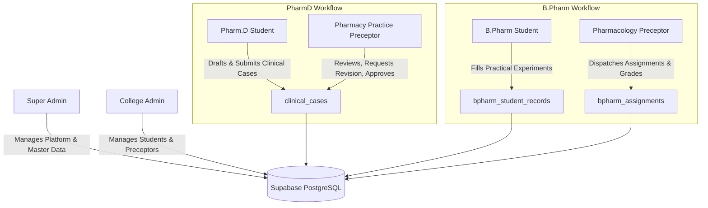

# 🏛️ PHARM.D & B.PHARM NEXUS — SYSTEM ARCHITECTURE & BLUEPRINT DOCUMENT

> **Platform Name:** PHARM.D & B.PHARM NEXUS  
> **System Status:** Production Ready  
> **Database:** Supabase (PostgreSQL) with Row-Level Security (RLS)  
> **Authentication:** Custom Session Token & Password Hash Validation  
> **Last System Audit:** September 2, 2026  

---

## 📑 TABLE OF CONTENTS
1. [System Overview & Architecture](#1-system-overview--architecture)
2. [Super Admin Portal (Platform Governance)](#2-super-admin-portal-platform-governance)
3. [College Admin Portal (Institutional Governance)](#3-college-admin-portal-institutional-governance)
4. [Pharm.D Ecosystem (Student & Pharmacy Practice Preceptor)](#4-pharmd-ecosystem-student--pharmacy-practice-preceptor)
5. [B.Pharm Ecosystem (Student & Pharmacology Preceptor)](#5-bpharm-ecosystem-student--pharmacology-preceptor)
6. [Complete Supabase Database Schema & Table Reference](#6-complete-supabase-database-schema--table-reference)
7. [Global Read-Only Soft-Lock Engine](#7-global-read-only-soft-lock-engine)
8. [Living Deployment Ledger](#8-living-deployment-ledger)

---

## 1. SYSTEM OVERVIEW & ARCHITECTURE

**PHARM.D & B.PHARM NEXUS** is a multi-tenant institutional ERP platform designed exclusively for pharmacy colleges. It provides dual academic workflows:
- **Pharm.D Workflow:** Clinical Case Management, Patient Profiles, Lab Investigations, Interventions, ADR Reporting, Preceptor Digital Signatures, and PDF Exporting.
- **B.Pharm Workflow:** Interactive Practical Experiment Engine, Master Pharmacology Library, Batch Assignment Creation, Record Submissions, and Practical Marks Evaluation.

---

## 2. SUPER ADMIN PORTAL (PLATFORM GOVERNANCE)

### A. Core Responsibilities
- Global platform governance, branding, and system metrics.
- Onboarding new colleges via registration request review.
- Managing college subscriptions (extending expiry, modifying student limits, toggling active/disabled state).
- Maintenance of global master datasets (Drug Knowledge, Lab Parameters, Investigation Master, Pharmacology Master Experiments).

### B. View Breakdown & Workflow Steps
1. **College Registration Approvals (`RegistrationRequestsView`):**
   - Reviews incoming college applications.
   - On **Approve**: System creates rows in `colleges` and `subscriptions` tables simultaneously.
   - On **Reject**: Marks status as `'Rejected'` with reason comments.
2. **College Management Directory (`CollegeManagementView`):**
   - Search & filter active or inactive colleges.
   - Edit subscription end dates, maximum student quotas, and contact info.
   - Trigger soft-lock or full institution disablement.
3. **Master Data Knowledge Base:**
   - **Drug Knowledge Master (`DrugKnowledgeMasterView`):** Manages generic names, brand names, indications, side effects, contraindications, dosage.
   - **Lab Parameter Master (`LabParameterMasterView`):** Defines lab tests, unit measures, normal ranges, and clinical significance.
   - **Other Investigations Master (`OtherInvestigationMasterView`):** Defines radiology/ECG diagnostic knowledge.
   - **Pharmacology Master Builder (`BPharmExperimentMasterView`):** Constructs experiment templates (Aim, Principle, Procedure, Observation Tables, Calculations).
4. **Platform Settings (`PlatformSettingsView`):**
   - Configures global application name (**PHARM.D & B.PHARM NEXUS**), support email, phone numbers, and platform logos.

### C. Database Tables Used
- `super_admins`, `registration_requests`, `colleges`, `subscriptions`, `platform_settings`, `drug_knowledge`, `lab_parameter_knowledge`, `other_investigation_knowledge`, `bpharm_master_experiments`.

---

## 3. COLLEGE ADMIN PORTAL (INSTITUTIONAL GOVERNANCE)

### A. Core Responsibilities
- Managing student and preceptor directory for the specific institution.
- Assigning students to preceptors.
- Uploading institutional branding assets for official PDF export generation.
- Monitoring college subscription status.

### B. View Breakdown & Workflow Steps
1. **Student Directory Management (`CollegeAdminStudentsView`):**
   - Add Pharm.D or B.Pharm students (Roll Number, Username, Password, Year, Semester).
   - Assign/Reassign Pharmacy Practice Preceptors to Pharm.D students (`students.assigned_preceptor_id`).
   - Filter students by course, year, and active status.
2. **Preceptor Directory Management (`CollegeAdminPreceptorsView`):**
   - Create preceptor accounts specifying department (`Pharmacy Practice` or `Pharmacology`).
   - Monitor preceptor active status and assigned student count.
3. **Document Branding Configuration (`DocumentBrandingView` & `BPharmDocumentBrandingView`):**
   - Upload header logos, customize watermark text & opacity, primary brand color.
   - Toggle digital signature displays for preceptors on official exports.
4. **Subscription Status Widget (`CollegeAdminLayout`):**
   - Displays real-time subscription countdown and warning banners if nearing expiry or expired.

### C. Database Tables Used
- `college_admins`, `students`, `preceptors`, `document_branding_settings`, `bpharm_branding_settings`, `subscriptions`.

---

## 4. PHARM.D ECOSYSTEM (STUDENT & PHARMACY PRACTICE PRECEPTOR)

### A. Pharm.D Student Workflow
1. **Case Creation (`AddNewCaseView`):**
   - Student initiates a new clinical case specifying IP/OP number, Ward, Department, Date of Admission, Date of Discharge.
   - Master record saved in `clinical_cases` with status `'Draft'`.
2. **Modular Data Documentation:**
   - **Patient Profile (`patient_profiles`):** Demographics, Chief Complaints, Past Medical History, Vital Signs, Provisional/Final Diagnosis.
   - **Lab Investigations (`patient_lab_investigations`):** Tests, observed values, normal reference ranges, clinical inferences.
   - **Prescription Details (`patient_prescribed_drugs`):** Drug name, dosage, route, frequency, duration.
   - **Other Diagnostic Tests (`patient_other_investigations`):** X-Ray, MRI, ECG findings.
   - **Pharmacist Interventions (`pharmacist_interventions`):** Drug involved, intervention type, physician acceptance status.
   - **ADR Reports (`adr_reports`):** Reaction details, Naranjo causality scale score, severity grading.
   - **Patient Counselling (`patient_counselling`):** Topics covered, special instructions, dietary advice.
   - **Drug Info Requests (`drug_information_requests`):** Clinician query, category, structured response, literature references.
3. **Case Submission (`submitCompleteClinicalCaseInSupabase`):**
   - Student submits complete case. Status changes from `'Draft'` to `'Submitted'`.
   - Notification row created in `workflow_notifications` for the assigned preceptor.

### B. Pharmacy Practice Preceptor Workflow
1. **Case Review Queue (`PreceptorCaseReviewView`):**
   - Displays all cases submitted by assigned students.
2. **Section-by-Section Audit (`PreceptorReviewCaseView`):**
   - Preceptor reviews patient profile, lab data, interventions, ADRs, and counselling notes.
3. **Evaluation Actions:**
   - **Approve:** Updates status to `'Approved'`, locks case editing (`case_locked = true`), attaches digital signature timestamp (`reviewed_at`).
   - **Request Revision:** Updates status to `'Revision Requested'` with review comments. Unlocks draft editing for the student.
   - **Reject:** Sets status to `'Rejected'`.

### C. Key Database Tables
- `clinical_cases`, `patient_profiles`, `patient_lab_investigations`, `patient_prescribed_drugs`, `patient_other_investigations`, `pharmacist_interventions`, `adr_reports`, `patient_counselling`, `drug_information_requests`, `clinical_case_review_history`, `workflow_notifications`.

---

## 5. B.PHARM ECOSYSTEM (STUDENT & PHARMACOLOGY PRECEPTOR)

### A. Pharmacology Preceptor Workflow
1. **Assignment Dispatch (`BPharmExperimentAssignmentView`):**
   - Selects a master pharmacology experiment from `bpharm_master_experiments`.
   - Defines target batch name, academic year, semester (Semester I to VIII), and due date.
   - Saves row into `bpharm_assignments`.
2. **Submission Review & Grading (`BPharmPreceptorSubmissionsView`):**
   - Audits student experiment data (observations, calculations, conclusions).
   - Assigns `marks_obtained` out of `max_marks` and inputs evaluator feedback.
   - Sets status to `'Evaluated'`.

### B. B.Pharm Student Workflow
1. **Accessing Assigned Practicals (`BPharmStudentPracticalsView`):**
   - Fetches active assignments for the student's college and batch from `bpharm_assignments`.
2. **Interactive Experiment Engine (`BPharmExperimentEngine`):**
   - Renders interactive step-by-step experiment UI (Aim, Principle, Procedure, Observation Tables, Calculations, Result).
   - Student enters observations and results into structured JSON blocks.
3. **Saving & Submitting:**
   - Saves progress in `bpharm_student_records` (Status `'Draft'` or `'Submitted'`).

### C. Key Database Tables
- `bpharm_master_experiments`, `bpharm_assignments`, `bpharm_student_records`, `bpharm_branding_settings`.

---

## 6. COMPLETE SUPABASE DATABASE SCHEMA & TABLE REFERENCE

| Table Name | Primary Purpose | Key Foreign Keys | Status / Enum Values |
| :--- | :--- | :--- | :--- |
| `super_admins` | System owners | None | Active / Inactive |
| `colleges` | Institutional tenants | `subscription_id` | Active / Disabled / Inactive |
| `subscriptions` | Expiry & Quotas | `college_id` | Active / Expired |
| `college_admins` | Institutional admin users | `college_id` | Active / Inactive |
| `students` | Pharm.D & B.Pharm students | `college_id`, `assigned_preceptor_id` | Course: 'Pharm.D'/'B.Pharm', Status: Active/Inactive |
| `preceptors` | Faculty evaluators | `college_id` | Dept: 'Pharmacy Practice'/'Pharmacology' |
| `registration_requests` | College onboarding queue | None | Pending / Approved / Rejected |
| `document_branding_settings` | Pharm.D PDF branding | `college_id` | N/A |
| `bpharm_branding_settings` | B.Pharm PDF branding | `college_id` | N/A |
| `clinical_cases` | Pharm.D master cases | `student_id`, `college_id`, `preceptor_id` | Draft / Submitted / Approved / Rejected / Revision Requested |
| `patient_profiles` | Demographics & Vitals | `clinical_case_id` | Draft / Submitted / Approved |
| `patient_lab_investigations` | Lab tests | `patient_profile_id` | N/A |
| `patient_prescribed_drugs` | Prescription drugs | `patient_profile_id` | N/A |
| `patient_other_investigations` | Radiology/ECG | `patient_profile_id` | N/A |
| `pharmacist_interventions` | Clinical interventions | `clinical_case_id` | Draft / Submitted / Approved |
| `adr_reports` | Adverse Drug Reactions | `clinical_case_id` | Draft / Submitted / Approved |
| `patient_counselling` | Patient counselling | `clinical_case_id` | Draft / Submitted / Approved |
| `drug_information_requests` | Drug Info queries | `clinical_case_id` | Draft / Submitted / Approved |
| `bpharm_master_experiments` | Pharmacology library | None | `is_active` (boolean) |
| `bpharm_assignments` | Preceptor practical tasks | `college_id`, `preceptor_id`, `master_experiment_id` | Active / Closed |
| `bpharm_student_records` | Student practical submissions | `student_id`, `assignment_id`, `master_experiment_id` | Draft / Submitted / Evaluated / Revision Requested |
| `workflow_notifications` | In-app notifications | `user_id`, `clinical_case_id` | Read / Unread |

---

## 7. GLOBAL READ-ONLY SOFT-LOCK ENGINE

### How Expiry Grace Period & Read-Only Lock Operates
1. **Hook Invocation (`useCollegeSubscription`):**
   - Automatically executed in all layout components (`PharmDStudentLayout`, `BPharmStudentLayout`, `PharmPracticePreceptorLayout`, `PharmacologyPreceptorLayout`, `CollegeAdminLayout`).
2. **Expiry Calculation (`subscriptionUtils.js`):**
   - Calculates remaining days: `daysRemaining <= 0` triggers **`isExpired = true`**.
   - Robust date fallbacks check `sub.subscription_end_date`, `sub.subscription_expiry_date`, `col.subscription_expiry_date`, and `col.subscription_end_date`.
3. **UI Lock & Banner Enforcement:**
   - **Banner Display:** Renders `<ExpiredSubscriptionBanner forceShow={isExpired} />` across the top of the portal.
   - **Action Disablement:** Adds `disabled={isExpired}` and `opacity-50 cursor-not-allowed grayscale` styling to:
     - Sidebar "Add New Case" buttons.
     - Student "New Clinical Case" primary buttons.
     - Preceptor evaluation buttons ("Approve", "Reject", "Request Revision", "Submit Evaluation").

---

## 8. LIVING DEPLOYMENT LEDGER

* **2026-09-02 (Build 2.1.0):** Added `experiment_number` column to `bpharm_master_experiments` and `bpharm_student_records` in Supabase DB via DDL, and added `Exp No.` input field in Master Builder UI and badge display across views.
* **2026-09-02 (Build 2.0.9):** Fixed graph axis display labels (`X-Axis` and vertical `Y-Axis`), moved Legend to top to eliminate overlap with bottom ticks, and enabled multi-curve graph rendering across Saved Experiment Preview and Student Learning Mode views.
* **2026-09-02 (Build 2.0.8):** Deployed Explicit Dropdown Axis Selectors & Custom Curve Mapping Options in B.Pharm Master Experiment Builder (allows Super Admin to map X & Y columns for each drug curve via dropdown menus).
* **2026-09-02 (Build 2.0.7):** Deployed Multi-Drug Multi-Line Graph Plotting Engine supporting both Shared Dose (`DOSE, DRUG A, DRUG B`) and Paired Column (`DRUG-A, RESP A, DRUG-B, RESP B`) modes with distinct line colors and graph legends.
* **2026-09-02 (Build 2.0.6):** Added direct visual Column and Row editing controls in B.Pharm Master Experiment Builder (allows editing column header names directly, adding/deleting columns via `[ + Add Column ]`, and smooth typing in `Table Columns`).
* **2026-09-02 (Build 2.0.5):** Streamlined B.Pharm Master Experiment Builder action bar into 3 core unified Learning Mode blocks: 1. Text Block (Word paste auto-cleaner), 2. Procedure Flowchart (`[ + Add Step Box ]` with connecting down arrows `⬇`), 3. Observation Table & Graph (unified table + axis config + real-time live graph plotter).
* **2026-09-02 (Build 2.0.4):** Injected Live Real-Time Plotted Line Graph Preview directly inside Table Block Builder in Super Admin view (renders live as numbers are typed in pre-filled reference rows).
* **2026-09-02 (Build 2.0.3):** Implemented Pre-Loaded Observation Table Data Editor in B.Pharm Master Experiment Builder and Auto-Plotted Line Graph curve rendering for Learning Mode.
* **2026-09-02 (Build 2.0.2):** Deployed MS Word Paste Auto-Cleaner (`handleTextPaste`) across all Text blocks in the Master Experiment Builder to preserve headings, bold labels (`Meaning:`, `Use:`), bullet lists, and paragraph line breaks.
* **2026-09-02 (Build 2.0.1):** Configured full Row-Level Security (RLS) policies across all B.Pharm tables (`bpharm_master_experiments`, `bpharm_assignments`, `bpharm_student_records`, `bpharm_branding_settings`).
* **2026-09-02 (Build 2.0.0):** Renamed global platform branding to **PHARM.D & B.PHARM NEXUS**. Deployed B.Pharm Student & Pharmacology Preceptor portals. Implemented zero-grace-period global Read-Only Soft-Lock mode.

